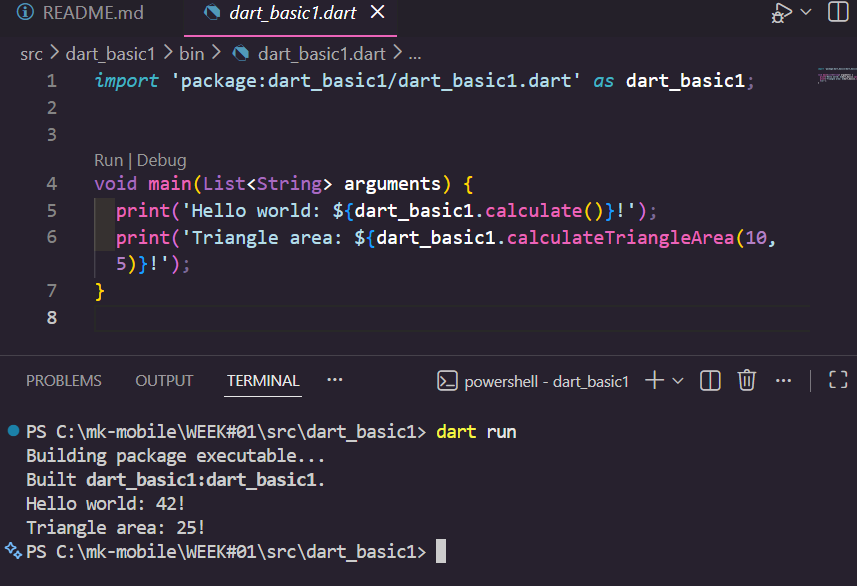

# Practicum Report - Mobile Programming

**Name:** Tria Ananda Fadillah  
**NIM:** 244107060149 
**Class:** SIB 2G

---

## Task Description
This practicum focuses on the initial setup of the development environment by installing and configuring the Dart SDK, followed by creating and executing a simple "Hello World" program to verify the installation.

## Implementation Steps
1. **Download Dart SDK:** Accessed the official Dart website to download the installation package suitable for the operating system.
2. **Extract to Permanent Directory:** Extracted the SDK files to a permanent and easily accessible location (e.g., `C:\dart-sdk`).
3. **Configure Environment Variables:** Registered the `bin` folder of the Dart SDK into the system Path to enable dart commands in the terminal.
4. **Installation Validation:** Ran the `dart --version` command in the terminal to verify that the installation was successful.
5. **Create Hello World Program:** Wrote a simple "Hello World" script as a universal convention to test the system's ability to execute Dart code.

## Result Analysis
After configuring the environment, the `dart --version` command successfully displayed the installed version, confirming the Path was set correctly. The "Hello World" program executed without errors, ensuring that all components were properly installed and ready for mobile development.

## Challenges & Solutions
* **Challenge:** Command 'dart' not recognized in terminal.
* **Solution:** Re-checked and added the correct absolute path of the Dart SDK `bin` folder to the Environment Variables and restarted the terminal.

---

## Visual Documentation (Output)
Below is the evidence of the program execution:
