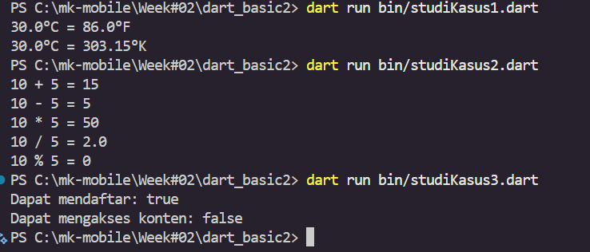
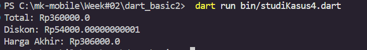
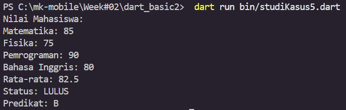
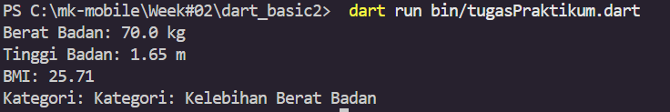
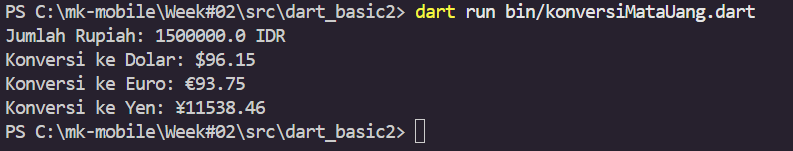
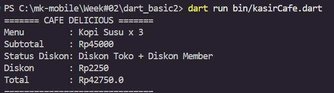
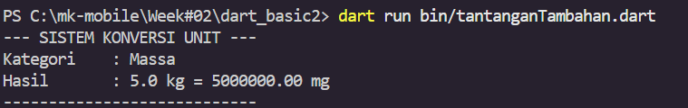

# Week 2 Practicum Report - Mobile Programming

**Name:** Tria Ananda Fadillah  
**NIM:** 244107060149 
**Class:** SIB 2G

---

## Task Description
This practicum focuses on fundamental Dart programming concepts, including variables, data types, and operators. The goal is to implement logical thinking and problem-solving through various study cases such as BMI calculation, currency conversion, and a integrated cafe cashier system.

## Visual Documentation (Output)
Below is the evidence of the program execution:

### Summary & Conclusion
Based on the implementation of all study cases and practicum challenges, it can be concluded that:

1. **Data Types & Variables Mastery**: Selecting the correct data types, such as using `double` for precise calculations in BMI and unit conversion, is critical to maintain data integrity. 
2. **Efficiency with Maps**: Implementing `Map` is highly effective for storing paired data (e.g., Currency Exchange Rates or Cafe Menus). This approach makes the code more modular and easier to maintain compared to using multiple standalone variables.
3. **Integrated Operator Implementation**: Combining various operators (Arithmetic, Relational, Logical, and Ternary) allows for the creation of complex logic within a concise code structure. For instance, in the cashier system, the promotion status can be determined instantly using the **Ternary Operator**.
4. **Validation and Formatting**: As taught in the module, input validation (e.g., preventing negative values) and the use of `toStringAsFixed()` are essential in building real-world applications to ensure a good user experience and clean output.