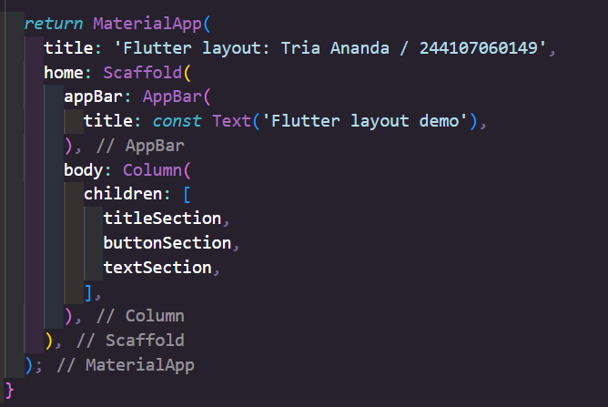
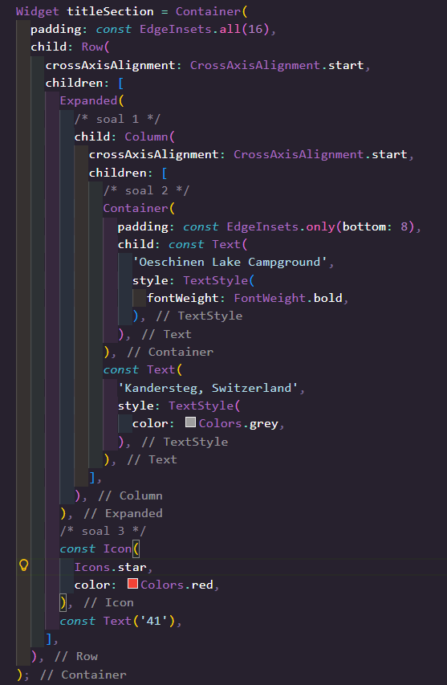
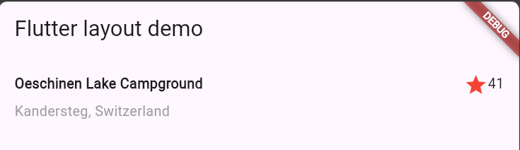
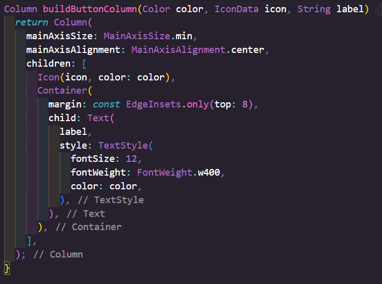
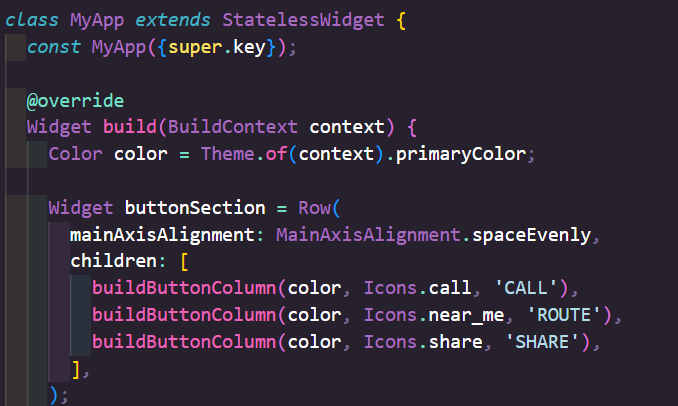
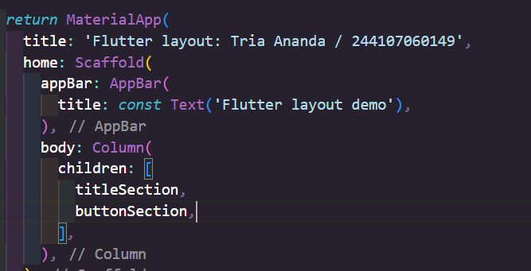
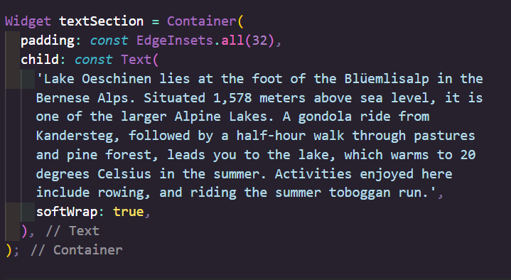
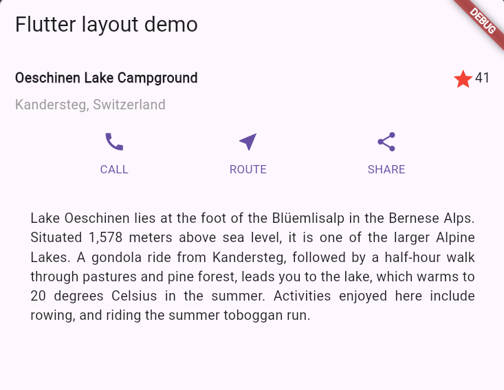
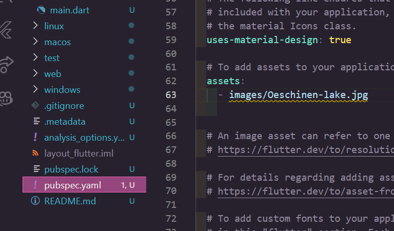
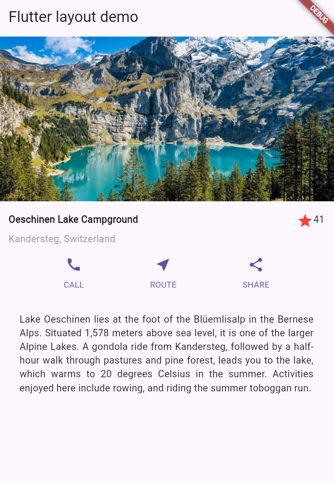

# Laporan Tugas Praktikum Pemrograman Mobile - Week 06
**Nama**: Tria Ananda  
**NIM**: 244107060149  
**Kelas**: SIB 2G  

---

## 📱 Praktikum 1: Membangun Layout di Flutter

**Langkah:**
1. Buatlah sebuah project flutter baru dengan nama layout_flutter. Atau sesuaikan style laporan praktikum yang Anda buat.
2. Buka file main.dart lalu ganti dengan kode berikut. Isi nama dan NIM Anda di text title.
> 
3. Identifikasi layout diagram seperti baris dan kolom.
> 
4. Pertama, Anda akan membuat kolom bagian kiri pada judul. Tambahkan kode berikut di bagian atas metode build() di dalam kelas MyApp:
> 

---

## 📱 Praktikum 2: Implementasi button row

**Langkah:**
1. Buat method Column _buildButtonColumn
Buatlah metode pembantu pribadi bernama buildButtonColumn(), yang mempunyai parameter warna, Icon dan Text, sehingga dapat mengembalikan kolom dengan widgetnya sesuai dengan warna tertentu.
> 
2. Buat widget buttonSection
Buat Fungsi untuk menambahkan ikon langsung ke kolom. Teks berada di dalam Container dengan margin hanya di bagian atas, yang memisahkan teks dari ikon.
Bangun baris yang berisi kolom-kolom ini dengan memanggil fungsi dan set warna, Icon, dan teks khusus melalui parameter ke kolom tersebut.
> 
3. Tambah button section ke body 
Tambahkan variabel buttonSection ke dalam body 
> 

---
## 📱 Praktikum 3: Implementasi text section

**Langkah:**
1. Buat widget textSection
Tentukan bagian teks sebagai variabel. Masukkan teks ke dalam Container dan tambahkan padding di sepanjang setiap tepinya. Tambahkan kode berikut tepat di bawah deklarasi buttonSection:
Dengan memberi nilai softWrap = true, baris teks akan memenuhi lebar kolom sebelum membungkusnya pada batas kata.
> 
2. Tambahkan variabel text section ke body
Tambahkan widget variabel textSection ke dalam body seperti berikut:
> 
> 

---
## 📱 Praktikum 4: Implementasi image section

**Langkah:**
1. Siapkan aset gambar
Buatlah folder images di root project layout_flutter. Masukkan file gambar tersebut ke folder images, lalu set nama file tersebut ke file pubspec.yaml seperti berikut:
> 
2.  Tambahkan gambar ke body
Tambahkan aset gambar ke dalam body seperti berikut:
> 
3. Terakhir, ubah menjadi ListView
Atur semua elemen dalam ListView, bukan Column, karena ListView mendukung scroll yang dinamis saat aplikasi dijalankan pada perangkat yang resolusinya lebih kecil.

Hasil Praktikum:
> 

